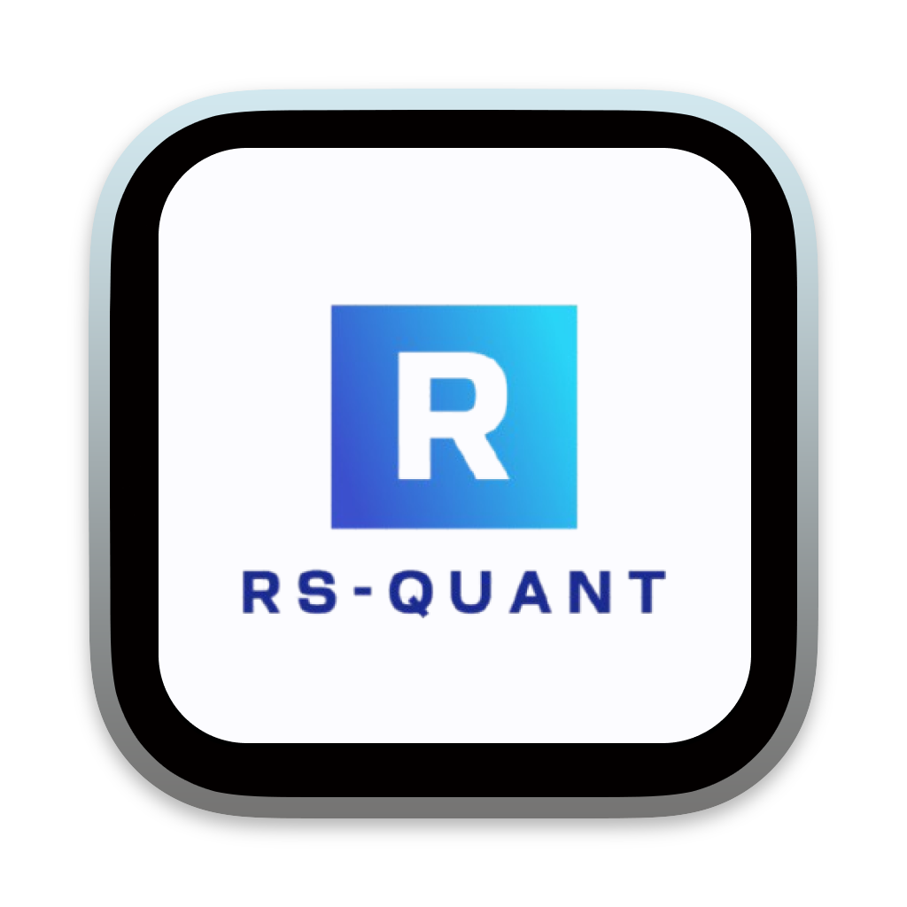

<h1 align="center">
    
     
    rs-quant
</h1>

    <strong>rs-quant</strong> is a Rust library designed for quantitative finance enthusiast. It provides a robust set of models,
    formulas, and tools to perform financial analysis for multiple financials instruments.

    This repo will be developed to be used in an integrated and optimized manner with the <strong>portfolio-rs</strong> crate (also
    currently in development) and <strong>securities-master</strong> project (database managed using python, currently in development).

    rs-quant is currently in its early stages of development. It will be constantly changing, and may not be finished. Who
    knows...

